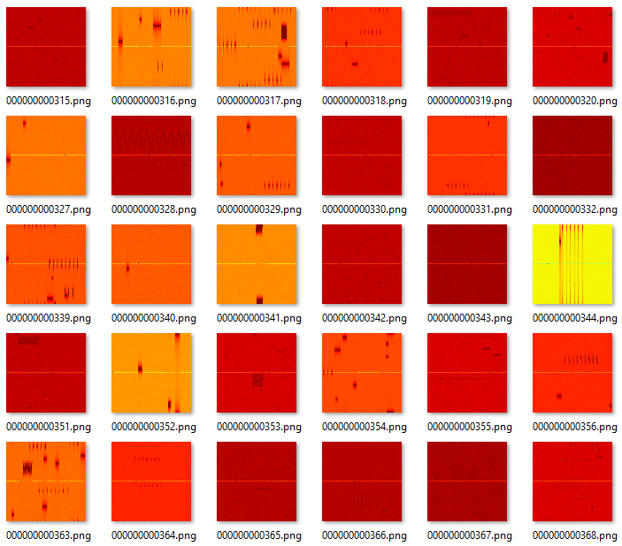

[](https://arxiv.org/abs/2501.10407) [](https://www.kaggle.com/datasets/abcxyzi/raddet-icassp-2025) [](https://creativecommons.org/licenses/by-nc-sa/4.0/)

# Radar Spectrum Detection Dataset (RadDet)

We introduce a challenging public dataset for radar detection (RadDet), comprising a large corpus of radar signals occupying a wideband spectrum across diverse radar density environments and signal-to-noise ratio settings. This repo contains the download links to our radar dataset and the associated conference paper "RadDet: A Wideband Dataset for Real-Time Radar Spectrum Detection". This work was published at the 2025 IEEE International Conference on Acoustics, Speech, and Signal Processing (ICASSP 2025) in Hyderabad, India.

You can access our preprint 📄 here: https://arxiv.org/abs/2501.10407

You can also watch our ICASSP 2025 presentation ▶️ here: https://youtu.be/H6LI_ZrdgeI

> Huang, Z., Denman, S., Pemasiri, A., Martin, T., & Fookes, C. (2025). RadDet: A wideband dataset for real-time radar spectrum detection. ICASSP 2025-2025 IEEE International Conference on Acoustics, Speech and Signal Processing (ICASSP), 1–5. IEEE.

## Overview

Quick links:

- [RadDet Details](#raddet-details)
- [Configuration File](#configuration-file)
- [Bounding Box Annotations](#bounding-box-annotations)
- [Download Instructions](#download-instructions)
- [Extracting Dataset Parts](#extracting-dataset-parts)
- [Citation](#citation)

⚙️ There are several radar datasets presented in our paper:

1. **RadDet-1T** - this is our proposed dataset, it contains up to 9 signal targets per frame.
2. **RadDet-9T** - this is our proposed dataset, it contains at most 1 signal target per frame.
3. **NIST-CBRS** - this is a radar dataset [created by NIST](https://www.nist.gov/publications/rf-dataset-incumbent-radar-signals-35-ghz-cbrs-band) containing at most 1 signal target per frame. We adapted the [original dataset](https://data.nist.gov/od/id/mds2-2116) and modified it in our experiments, the modified version of the dataset (NIST-CBRS) is provided here for reference. Please cite the original work by NIST if you wish to adapt their dataset in your research.

⚙️ Each radar dataset contains max-hold spectrograms provided in three resolutions:

- `128 x 128` - 128 by 128 spectrograms, please refer to our paper for the specific t-f resolution.
- `256 x 256` - 256 by 256 spectrograms, please refer to our paper for the specific t-f resolution.
- `512 x 512` - 512 by 512 spectrograms, please refer to our paper for the specific t-f resolution.

## RadDet Details

RadDet introduces 11 radar classes, including 6 new LPI polyphase codes (P1, P2, P3, P4, Px, Zadoff-Chu) and a new wideband frequency-modulated continuous wave (FMCW), all coexisting across a 500 MHz band.

RadDet contains a total of 40,000 radar frames provided in three parts:
- Training set - contains 20,000 frames.
- Validation set - contains 14,000 frames.
- Test set - contains 6,000 frames.

We sample SNR from a uniform distribution to produce signal frames that fall within −20 and 20 dB at a resolution of 8 dB. This means that there are more than 6,500 unique signals genreated per SNR.

To investigate wideband spectrum detection in different scenarios, we provide RadDet in two different radar environments:

- Our sparse dataset (RadDet-1T) provides at most a single radar instance per frame whereby the probability of a radar being present in a scene is 50%. Note, the notation `1T` simplt means a single target.
- Our dense dataset (RadDet-9T) contains up to 9 radar instances per frame where the probability of background (noise-only) frames is 10%. RadDet-9T represents a conservative dense maritime radar environment.

### RadDet Frame

Visualisation of frames from RadDet:



## Configuration File

Each dataset contains a configuration file called `data.yaml` provided in the standard YOLO-format. You can use this configuration file to create custom data modules for your project.

An example configuration file is shown below:

```yaml
# Dataset root dir
path: ../Datasets/<DATASET_NAME>

# Train, validation, and test dataset paths (relative to path)
train: images/train
val: images/val
test: images/test

# Signal classes
names: 
  0: Rect
  1: Barker
  2: Frank
  3: P1
  4: P2
  5: P3
  6: P4
  7: Px
  8: ZadoffChu
  9: LFM
  10: FMCW
```

## Bounding Box Annotations

The bounding box annotations are provided as `.txt` files following the standard YOLO-format. Each `.txt` file corresponds to a unique `.png` file with the same name, i.e., `train/000000000000.txt` contains labels for `train/000000000000.png`.

An example `.txt` file containing 5 bounding boxes:

```txt
0 0.611153 0.540000 0.250000 0.039563
9 0.263525 0.460000 0.040000 0.116000
4 0.273151 0.780000 0.550000 0.041063
3 0.804995 0.620000 0.055000 0.041920
3 0.259591 0.660000 0.035000 0.041920
```

## Download Instructions

The official RadDet dataset can be downloaded from [Kaggle](https://www.kaggle.com/datasets/abcxyzi/raddet-icassp-2025). The total size of the combined datasets is approximately `58.43 GB`. We provide the data in three different resolutions in this release:


⚙️ Low resolution: `128 x 128`

- **RadDet-1T-128** - approx. file size of 0.5 GB
- **RadDet-9T-128** - approx. file size of 0.5 GB
- **NIST-CBRS-128** - approx. file size of 1 GB

⚙️ Medium resolution: `256 x 256`

- **RadDet-1T-256** - approx. file size of 2.5 GB
- **RadDet-9T-256** - approx. file size of 2.5 GB
- **NIST-CBRS-256** - approx. file size of 5 GB (2 parts)

⚙️ High resolution: `512 x 512`

- **RadDet-1T-512** - approx. file size of 12 GB (4 parts)
- **RadDet-9T-512** - approx. file size of 12 GB (4 parts)
- **NIST-CBRS-512** - approx. file size of 20 GB (6 parts)

## Extracting Dataset Parts

> There should be a total of 21 downloadable `tar` files. These files will need to be extracted and re-combined to obtain the original datasets.

To extract and combine multiple parts of the dataset, for example:

```bash
# We want to re-combine these parts into a single "raddet40k512hw001tv2.tar" file
raddet40k512hw001tv2.tar.part-aa
raddet40k512hw001tv2.tar.part-ab
raddet40k512hw001tv2.tar.part-ac
raddet40k512hw001tv2.tar.part-ad
```

Download the individual parts to a local directory, then run the following commands in this order:

```bash
# Combine the individual parts into a single .tar.gz archive
cat raddet40k512hw001tv2.tar.part-* > raddet40k512hw001tv2.tar.gz

# Unpack the .tar.gz archive to retrieve the dataset
tar -xf raddet40k512hw001tv2.tar
```

You can also download the original (unmodified) NIST dataset [here](https://data.nist.gov/od/id/mds2-2116). Please also cite the [original work](https://www.nist.gov/publications/rf-dataset-incumbent-radar-signals-35-ghz-cbrs-band) by NIST if you wish to use their dataset in your research.

## Citation

💡 Please cite our conference paper if you find it helpful for your research. Cheers.

```
@inproceedings{huang2025raddet,
  author    = {Zi Huang and Simon Denman and Akila Pemasiri and Terrence Martin and Clinton Fookes},
  title     = {RadDet: A Wideband Dataset for Real-Time Radar Spectrum Detection},
  booktitle = {Proceedings of the IEEE International Conference on Acoustics, Speech and Signal Processing (ICASSP)},
  year      = {2025},
  pages     = {1--5},
  doi       = {10.1109/ICASSP49660.2025.10887772},
  keywords  = {Time-frequency analysis, Annotations, Radar detection, Radar, Speech recognition, Benchmark testing, Real-time systems, Wideband, Signal resolution, Signal to noise ratio, Spectrum sensing, Radar signal recognition, Realtime detection, Wideband radar dataset}
}
```
